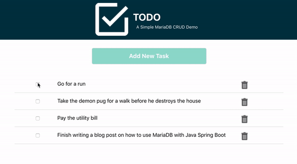

# TODO

**TODO** is a web application that introduces you to the power, performance, and simplicity of [MariaDB](https://mariadb.com/products/).

<p align="center" spacing="10">
    <kbd>
        
    </kbd>
</p>

This application is made of two parts:

* Client
    - web UI that communicates with REST endpoints available through an API app (see below).
    - is a React.js project located in the [client](src/client) folder.
* API
    - uses the [MariaDB Python Connector](https://github.com/mariadb-corporation/mariadb-connector-python) to connect to MariaDB.
    - is a Python project located in the [api](src/api) folder.

This README will walk you through the steps for getting the TODO web application up and running using MariaDB.

# Table of Contents
1. [Requirements](#requirements)
2. [Getting started with MariaDB](#mariadb)
3. [Get the code](#code)
4. [Create the database and table](#schema)
5. [Configure, build and run the apps](#app)
    1. [Configure](#configure-api-app)
    2. [Create and activate a Python virtual environment](#activate-virtual-env)
    3. [Install Python packages](#install-python-packages)
    4. [Build and run the Python API app](#build-run-api)
    5. [Build and run the Client app](#build-run-client)
6. [Support and contribution](#support-contribution)
7. [License](#license)

## Requirements <a name="requirements"></a>

This sample application requires the following to be installed/enabled on your machine:

* [Python (v. 3+)](https://www.python.org/downloads/)
* [MariaDB Connector/C (v. 3.1.5+)](https://mariadb.com/products/skysql/docs/clients/mariadb-connector-c-for-skysql-services/) (used by Connector/Python)
* [Node.js (v. 12+)](https://nodejs.org/docs/latest-v12.x/api/index.html) (for the Client/UI app)
* [NPM (v. 6+)](https://docs.npmjs.com/) (for the Client/UI app)
* [MariaDB command-line client](https://mariadb.com/products/skysql/docs/clients/mariadb-clients/mariadb-client/) (optional), used to connect to MariaDB database instances.

## 1.) Getting Started with MariaDB <a name="mariadb"></a>

[MariaDB](https://mariadb.com) is a community-developed, commercially supported relational database management system, and the database you'll be using for this application.

If you don't have a MariaDB database up and running you can find more information on how to download, install and start using a MariaDB database in the [MariaDB Quickstart Guide](https://github.com/mariadb-developers/mariadb-getting-started).

## 2.) Get the code <a name="code"></a>

First, use [git](git-scm.org) (through CLI or a client) to retrieve the code using `git clone`:

```
$ git clone https://github.com/mariadb-developers/todo-app-python.git
```

Next, because this repo uses a [git submodule](https://git-scm.com/book/en/v2/Git-Tools-Submodules), you will need to pull the [client application](https://github.com/mariadb-developers/todo-app-client) using:

```bash
$ git submodule update --init --recursive
```

## 3.) Create the database and table <a name="schema"></a>

[Connect to your MariaDB database](https://mariadb.com/products/skysql/docs/clients/) (from [Step #2](#mariadb)) and execute the following SQL scripts using the following options:

a.) Use the [MariaDB command-line client](https://mariadb.com/products/skysql/docs/clients/mariadb-clients/mariadb-client/) to execute the SQL contained within [schema.sql](schema.sql).

_Example command:_
```bash
$ mariadb --host HOST_ADDRESS --port PORT_NO --user USER --password PASSWORD < schema.sql
```

**OR**

b.) Copy, paste and execute the raw SQL commands contained in [schema.sql](schema.sql) using a [client of your choice](https://mariadb.com/products/skysql/docs/clients/).

```sql
CREATE DATABASE todo;

CREATE TABLE todo.tasks (
  id INT(11) unsigned NOT NULL AUTO_INCREMENT,
  description VARCHAR(500) NOT NULL,
  completed BOOLEAN NOT NULL DEFAULT 0,
  PRIMARY KEY (id)
);
```

## 4.) Configure, Build and Run the App <a name="app"></a>

This application is made of two parts:

* Client
    - web UI that communicates with REST endpoints available through an API app (see below).
    - is a React.js project located in the [client](src/client) (/src/client) folder.
* API
    - uses the [MariaDB Python Connector](https://github.com/mariadb-corporation/mariadb-connector-python) to connect to MariaDB.
    - is a Python project located in the [api](src/api) (/src/api) folder.

The following steps, `a` through `e`, will walk you through the process of configuring, building and running the `api` and `client` applications.

### a.) Configure the app <a name="configure-api-app"></a>

Configure the MariaDB connection by adding an [.env file](https://pypi.org/project/python-dotenv/) to the project within the [api](src/api) folder.

Example implementation:

```
DB_HOST=<host_address>
DB_PORT=<port_number>
DB_USER=<username>
DB_PASS=<password>
DB_NAME=todo
```

**Configuring db.js**

The environmental variables from `.env` are used within [src/api/tasks.py](src/api/tasks.py) for the MariaDB Python Connector connection configuration settings:

```python
config = {
    'host': os.getenv("DB_HOST"),
    'port': int(os.getenv("DB_PORT")),
    'user': os.getenv("DB_USER"),
    'password': os.getenv("DB_PASS"),
    'database': os.getenv("DB_NAME")
}
```

**Configuring .env and tasks.py for the MariaDB cloud database service [SkySQL](https://mariadb.com/products/skysql/)**

Note: MariaDB SkySQL requires SSL additions to connection. Details coming soon!

### b.) Create and activate a Python virtual environment <a name="activate-virtual-env"></a>

A virtual environment is a directory tree which contains Python executable files and other files which indicate that it is a virtual environment. Basically, it's the backbone for running your Python Flask app.

Creation of [virtual environments](https://docs.python.org/3/library/venv.html?ref=hackernoon.com#venv-def) is done by executing the following command (within [/src/api](src/api)):

```
$ python3 -m venv venv
```

**Tip**: Tip: pyvenv is only available in Python 3.4 or later. For older versions please use the [virtualenv](https://virtualenv.pypa.io/en/latest/) tool. 

Before you can start installing or using packages in your virtual environment, you’ll need to activate it. Activating a virtual environment will put the virtual environment-specific python and pip executables into your shell’s PATH.

Activate the virtual environment using the following command (within [/src/api](src/api)):

```bash
$ . venv/bin/activate activate
```

### c.) Install Python packages <a name="install-python-packages"></a>

[Flask](https://flask.palletsprojects.com/en/1.1.x/?ref=hackernoon.com) is a micro web framework written in Python. It is classified as a [microframework](https://en.wikipedia.org/wiki/Microframework) because it does not require particular tools or libraries. 

**TL;DR** It's what this app uses for the API.

This app also uses the MariaDB Python Connector to connect to and communicate with MariaDB databases. 

Install the necessary packages by executing the following command (within [/src/api](src/api)):

```bash
$ pip3 install flask mariadb python-dotenv
```

### d.) Build and run the [API app](src/api) <a name="build-run-api"></a>

Once you've pulled down the code and have verified that all of the required packages are installed you're ready to run the application! 

From [/src/api](src/api) execute the following CLI command to start the the Python project:

```bash
$ python3 api.py
```

**Note:** You will need to use seperate terminals for the `client` and `api` apps.

### e.) Build and run the [UI (Client) app](src/client) <a name="build-run-client"></a>

Once the API project is running you can now communicate with the exposed endpoints directly (via HTTP requests) or with the application UI, which is contained with the [client](src/client) folder of this repo.

To start the [client](src/client) application follow the instructions [here](https://github.com/mariadb-developers/todo-app-client).

## Support and Contribution <a name="support-contribution"></a>

Please feel free to submit PR's, issues or requests to this project project directly.

If you have any other questions, comments, or looking for more information on MariaDB please check out:

* [MariaDB Developer Hub](https://mariadb.com/developers)
* [MariaDB Community Slack](https://r.mariadb.com/join-community-slack)

Or reach out to us diretly via:

* [developers@mariadb.com](mailto:developers@mariadb.com)
* [MariaDB Twitter](https://twitter.com/mariadb)

## License <a name="license"></a>
[](https://opensource.org/licenses/MIT)
